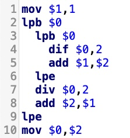
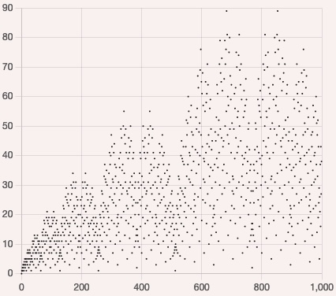
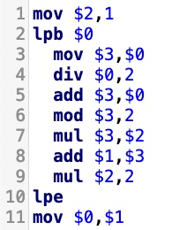
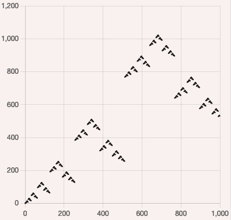
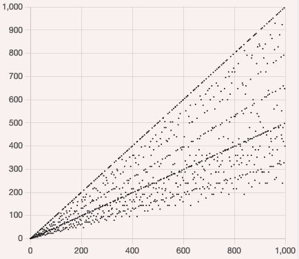

# LODA-RUST

Web editor for the [LODA language](https://loda-lang.org/) so programs can run in the browser.

### Examples to try out

<table>
<tr>
<td><a href="https://loda-lang.org/edit/?oeis=2487"> ▶️ Run program</a></td>
<td></td>
</tr>
<tr>
<td><a href="https://loda-lang.org/edit/?oeis=3188"> ▶️ Run program</a></td>
<td></td>
</tr>
<tr>
<td><a href="https://loda-lang.org/edit/?oeis=10"> ▶️ Run program</a></td>
<td> </td>
</tr>
</table>

---

Hi, I'm Simon Strandgaard. I'm a fan of the [On-Line Encyclopedia of Integer Sequences® (OEIS®)](https://oeis.org/) and a fan of AI. 
This is my attempt at doing a crossover of both. This is experimental stuff.

This repo is inspired by [Christian Krause's LODA project](https://github.com/loda-lang/loda-cpp) for mining integer sequences.
LODA has proved to be remarkable good at making programs that correspond to OEIS integer sequences.

# Vision for LODA

"Type in a few numbers, and get a formula".

# Contributing

Christian Krause's [loda-cpp miner](https://github.com/loda-lang/loda-cpp) have discovered 100000 programs so far. You can run the miner on your computer, and submit the programs being found.

You can implement LODA programs for OEIS sequences that doesn't already have a LODA program.

Join our Slack community.

