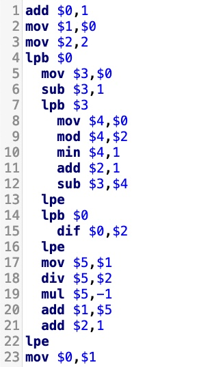

# LODA-RUST

Web editor for the [LODA language](https://loda-lang.org/) so programs can run in the browser.

 

**Examples to try out:**

<table>
<tr>
<td><a href="https://loda-lang.org/edit/?oeis=2487"> ▶️ Run program</a></td>
<td></td>
</tr>
<tr>
<td><a href="https://loda-lang.org/edit/?oeis=3188"> ▶️ Run program</a></td>
<td></td>
</tr>
<tr>
<td><a href="https://loda-lang.org/edit/?oeis=10"> ▶️ Run program</a></td>
<td> </td>
</tr>
</table>

---

# What is LODA-RUST

LODA-RUST is a Rust implementation of the [LODA-CPP project](https://github.com/loda-lang/loda-cpp).

The web editor uses LODA-RUST to run LODA programs in the browser.

The LODA-RUST command line interface is available for Linux/macOS/Windows. It can do these things:
- Evaluate a LODA program.
- Identify recurring patterns across LODA programs.
- Experimental LODA miner.

[LODA-RUST install guide](documents/install.md)

# Mining using LODA-RUST

Please instead use [Christian Krause's LODA miner](https://loda-lang.org/mining/), it's better.

The LODA-RUST miner is experimental, and not yet as good. 

[LODA-RUST mining guide](/documents/mining.md) and [verbose guide to mining on raspberrypi](https://github.com/loda-lang/loda-rust/blob/develop/documents/mining-on-raspberrypi.md).

# Contribute

If you have CPU to spare, [run the LODA miner](https://loda-lang.org/mining/) and help discover new programs.

[Join the LODA community on Slack](https://loda-lang.slack.com/)
